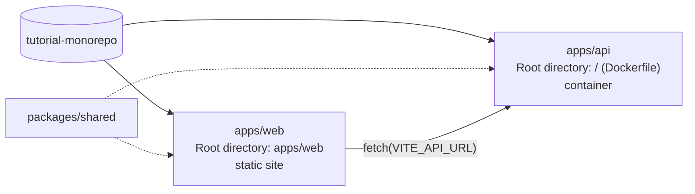

# Deploy from a monorepo to Light Cloud

One repository, two apps and a shared package, deployed as separate Light Cloud apps.

- `apps/web`: a React (Vite) page, served as a static site. Root directory `apps/web`. It calls the api with the address in `VITE_API_URL`.
- `apps/api`: an Express service, run as a container. Built by the `Dockerfile` at the repository root, so its Root directory is the repository root.
- `packages/shared`: code both apps import (`@tutorial/shared`), linked through npm workspaces.



A push that touches only `apps/web` redeploys the web app. The api redeploys on every push, because its Root directory is the whole repository. A change in `packages/shared` therefore reaches the api by itself, and the web app on its next deployment (Redeploy, or a push inside `apps/web`).

Tutorials that use this repository:

- Part 1, tag `part-1`: [Deploy From a Monorepo: One Repository, Several Apps](https://blog.light-cloud.com/tutorials/deploy-from-a-monorepo)
- Part 2, tag `part-2`: [Working With a Monorepo: Shared Packages and npm Workspaces](https://blog.light-cloud.com/tutorials/monorepo-shared-packages)

## Run it on your machine

```sh
npm install                                      # installs every workspace from the root
npm run start:api                                # http://localhost:8080
VITE_API_URL=http://localhost:8080 npm run build:web
```
