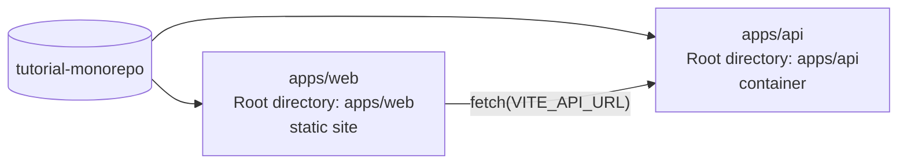

# Deploy from a monorepo to Light Cloud

One repository, two apps. Each folder under `apps/` is deployed as its own Light Cloud app with its own **Root directory**:

- `apps/web`: a React (Vite) page, served as a static site. It calls the api with the address in `VITE_API_URL`.
- `apps/api`: an Express service, run as a container on the port in `PORT`.



A push that touches only `apps/web` redeploys the web app; a push that touches only `apps/api` redeploys the api; a push that touches neither (this README, for example) redeploys nothing.

Tutorials that use this repository:

- [Deploy From a Monorepo: One Repository, Several Apps](https://blog.light-cloud.com/tutorials/deploy-from-a-monorepo)

## Run it on your machine

```sh
cd apps/api && npm install && npm start          # http://localhost:8080
cd apps/web && npm install && VITE_API_URL=http://localhost:8080 npm run dev
```

The web app shows the version the api answers with.
